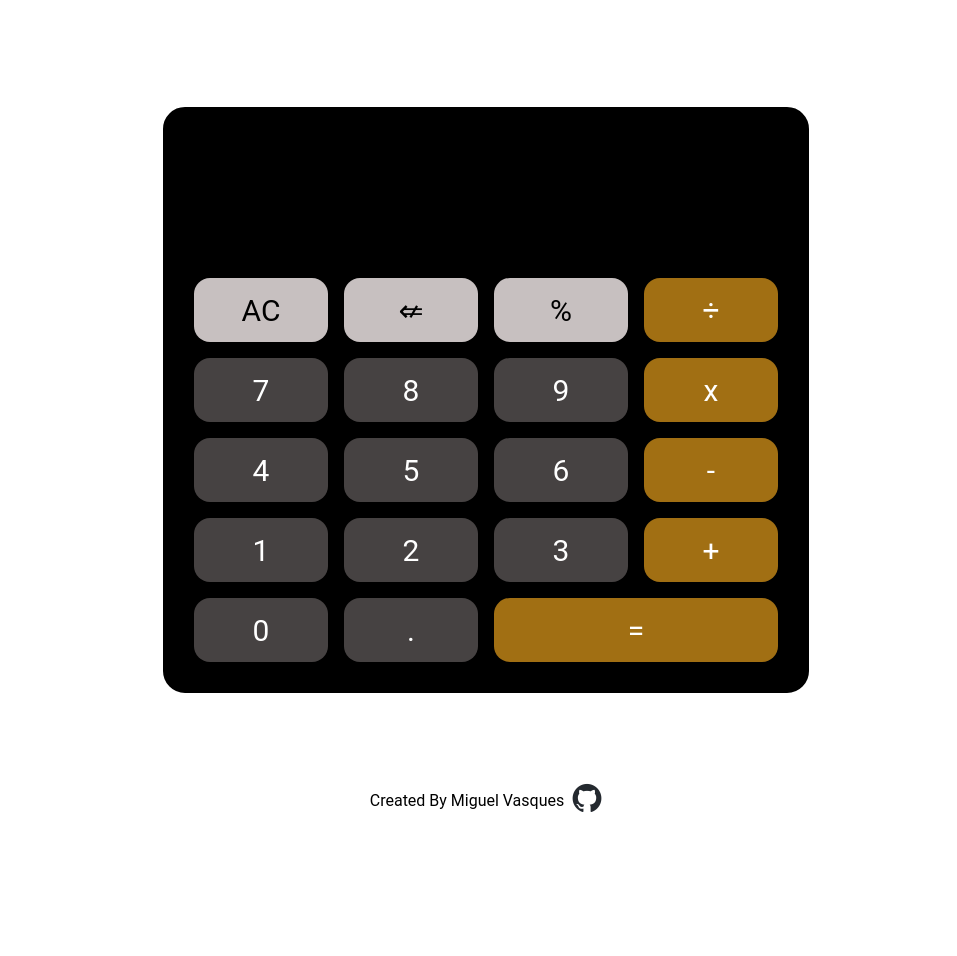

# Calculator

Browser calculator that can perform the following operations:  
- Add;
- Subtract;
- Multiply;
- Divide

Try it here:  
https://migvas.github.io/calculator/

Page Preview:  

Project from The Odin Project:  
https://www.theodinproject.com/lessons/foundations-calculator